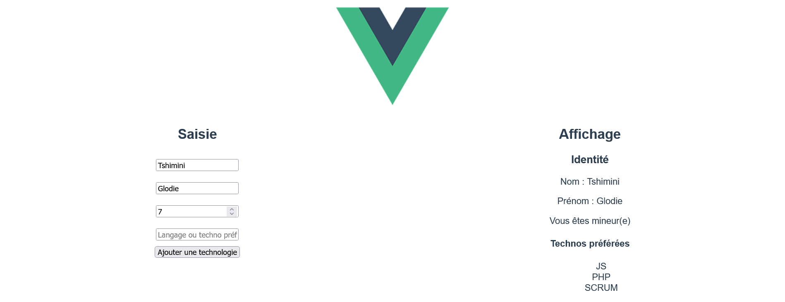

# Exercice 3

---

## Enoncé

1. Créez un nouveau projet Vue.
2. En utilisant les propriétés, directives et les événements Vue :
Ajoutez un formulaire pour saisir les informations suivantes : 
- Nom
- Prénom
- Age
- Langages et technos préférées (Un langage peut être ajouté à partir d'un bouton ou en appuyant sur la touche "entrée" du clavier, cf. illustration ci-dessous)
Affichez les informations suivantes :
- Nom
- Prénom
- Si l'âge est supérieur ou égal à 18 ans, affichez le message "vous êtes majeur(e)", sinon affichez "Vous êtes mineur(e)"
- Sous forme de liste à puces, les langages et technos préférées.

---

## Illustration

